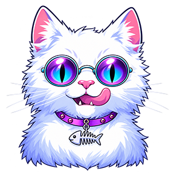
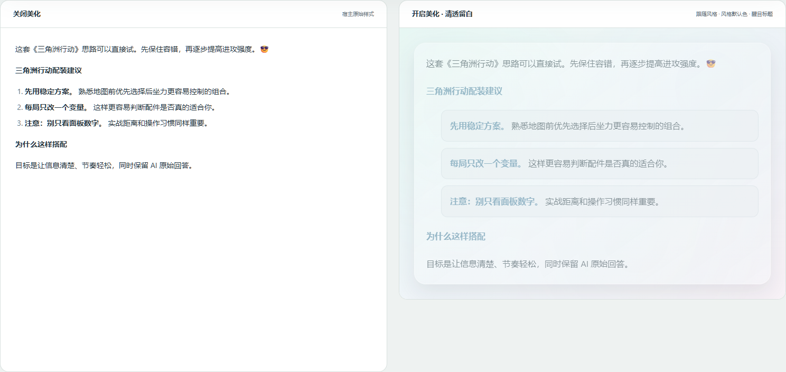
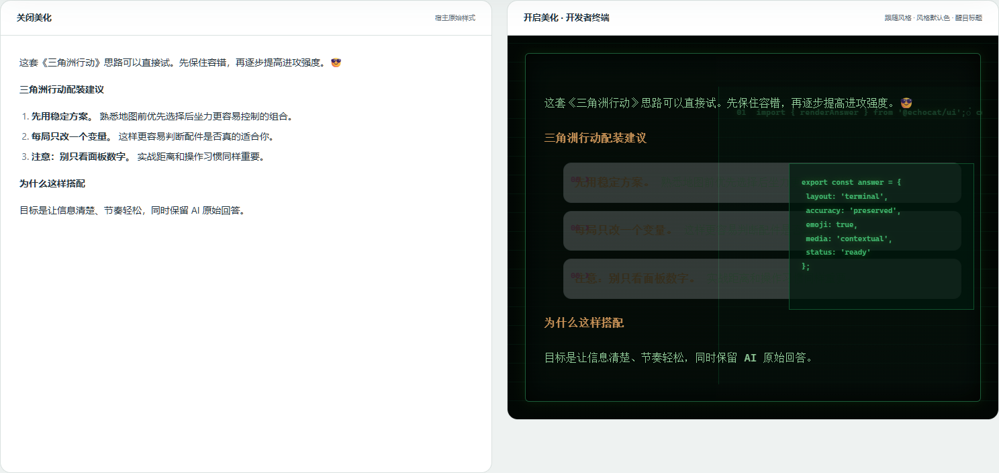
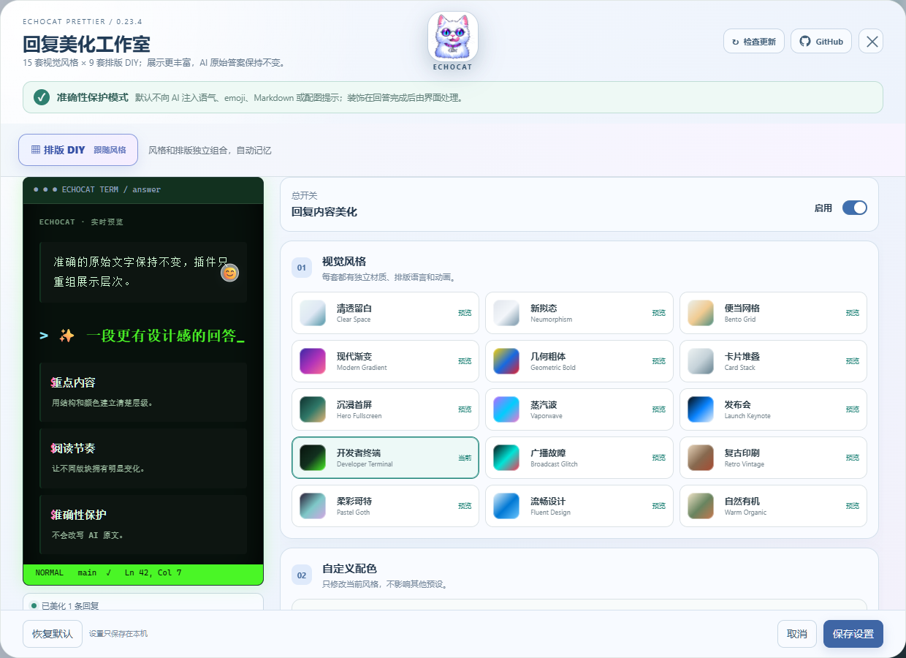

<p align="center">
  
</p>

<h1 align="center">DSH 聊天内容 排版</h1>

<p align="center"><b>EchoCat Prettier · 让 AI 回复拥有清楚的层级、丰富的视觉风格和自然的互动感。</b></p>

<p align="center">
  <a href="https://github.com/VDERR/dsh-echocat-prettier/releases/latest"></a>
  <a href="https://www.npmjs.com/package/dsh-echocat-prettier"></a>
  <a href="LICENSE"></a>
  
</p>

<p align="center">
  <a href="#安装">安装</a> ·
  <a href="#效果对比">效果对比</a> ·
  <a href="#设置界面">设置界面</a> ·
  <a href="https://github.com/VDERR/dsh-echocat-prettier/issues">反馈问题</a>
</p>

## 效果对比

下面两栏使用的是同一段 AI 原始回答。插件只重组浏览器里的显示层级，不改回答文字、顺序和结论。



<details>
  <summary><b>展开查看：开发者终端风格</b></summary>
  <br>
  
</details>

## 设置界面

在左侧栏上方、“插件 / 技能调用报告”之后、“工作区”之前打开“回复美化”，可以直接切换视觉风格、排版、独立配色、动画、emoji 和表情包数量。设置页顶部提供版本检查和 GitHub 入口。



## 主要功能

| 能力 | 说明 |
| --- | --- |
| 15 套视觉风格 | 清透留白、新拟态、便当网格、现代渐变、几何粗体、卡片堆叠、沉浸首屏、蒸汽波、发布会、开发者终端、广播故障等 |
| 9 套排版 DIY | 跟随风格、杂志封面、垂直时间轴、左右分屏、阶梯卡片、海报舞台、数据控制台、对话剧本、自由拼贴 |
| 每套独立配色 | 主色、辅助色和强调色分别保存，切换风格不会串色 |
| emoji 与表情包 | 单条回复可设置 2—8 个 emoji、1—4 张主题表情包，表情包居中展示 |
| 准确性保护 | 不修改提示词、模型参数、原始回答、节点顺序和复制内容 |
| 长回复保护 | 长内容自动暂停持续动画、复杂毛玻璃和跨栏排版，减少闪烁、卡顿及内容裁切 |
| 响应式设置页 | DSH 窗口缩放后仍能看到操作按钮，内容区域独立滚动 |

## 安装

推荐从 npm 安装公开版本：

```bash
dsh plugin --profile web add dsh-echocat-prettier
```

也可以直接从 GitHub 安装当前源码构建：

```bash
dsh plugin --profile web add github:VDERR/dsh-echocat-prettier
```

安装或升级后需要重启 DSH Desktop。也可以从 [Releases](https://github.com/VDERR/dsh-echocat-prettier/releases/latest) 下载 ZIP，并参照[安装、卸载与验收说明](docs/20260925_GPT安装卸载与验收说明_V2.3.6.md)操作。

## 准确性、网络与隐私

插件只处理浏览器展示层。默认不向 AI 注入语气、emoji、Markdown 或配图提示；回答生成完成后，再由插件进行显示装饰。

网络表情包只发送“表情包＋短主题＋情绪”，不会发送完整回答。当前实现不需要 API Key、没有付费接口、没有遥测或账号系统，设置仅保存在本机。网络失败时保持纯文字回答。

## 更新

打开左侧边栏的“回复美化”，点击设置页右上角的“检查更新”。插件会读取 GitHub 最新 Release；如果 GitHub API 暂时不可用，按钮会改为打开 Releases 页面。

## 开发与验证

要求 Node.js 22 或更新版本。

```bash
npm ci
npm run check
npm run test:final
npm run test:long
```

服务端入口为 `lib/index.js`，客户端入口为 `lib/client.js`，DSH/Cordis 清单为 `cordis.patch.yml`。仓库包含构建后的 `lib/`，便于 DSH 从 GitHub 直接安装。

当前版本：**0.23.6 / V2.3.6**。已改用 DSH `v0.1.7-rc.2` 的官方 `sidebar.panellist` 上方侧栏入口，并用匹配的主面板桥接到全局设置弹窗；自动测试、浏览器宿主夹具和长回复压力测试均已通过。

第三方组件与数据源说明见 [THIRD_PARTY_NOTICES.md](THIRD_PARTY_NOTICES.md)。
